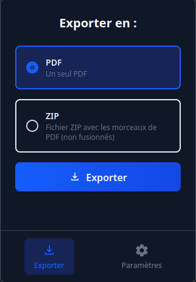
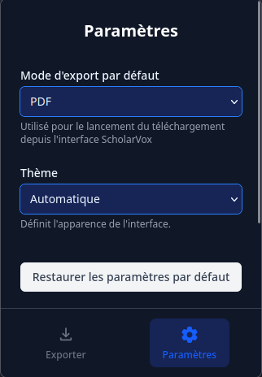
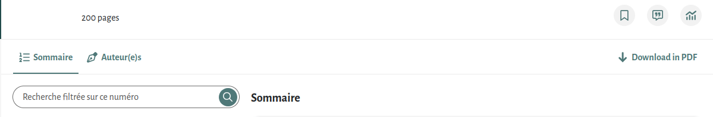

  

  <h3 align="center">Cairn  Downloader Extension</h3>
  

## Overview
This browser extension is designed for users with access to a Cairn instance, a platform for French students and academics. The extension allows you to save documents for offline use, overcoming the limitations of the native viewer.
## Building from source
Simply run `npm install` and then `npm run build`. It will create a `build` folder when you can find the extension.
## Usage Guidelines & Risks
- **Intended Use:**
  - This extension is for personal use only. Mass downloading for redistribution (e.g., uploading to Z-Lib) is strictly prohibited.
  - If discovered, your account may be disabled, your institution could face issues, and agreements between the Couperin consortium and publishers could be jeopardized, affecting all institutions.

## Screenshots & Demo
Everyone loves screenshots! Here are some examples:

## Disclaimer
This extension is intended for personal, non-commercial use only. Please respect the terms of service of your institution and Cairn. Misuse may result in account suspension and broader consequences for your institution and the academic community.

---

*For more information, see the French user documentation in `docs/users.md`.*
